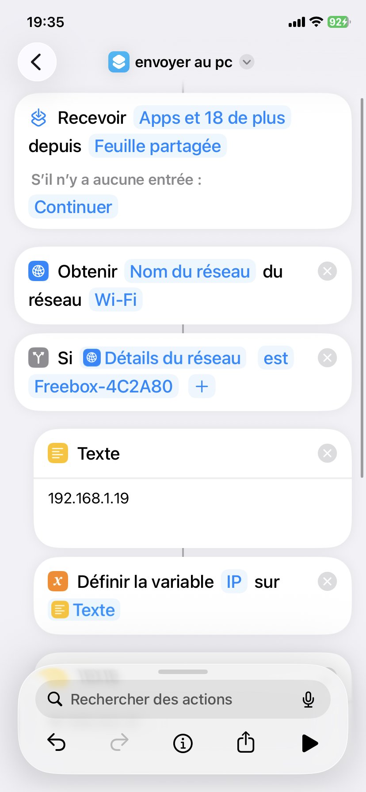

# iPhone → PC : envoi de photos et presse-papier

Serveur Flask dockerisé permettant d'envoyer des photos et du texte depuis un iPhone vers un PC Ubuntu, en deux taps depuis le menu de partage natif iOS.

```
iPhone (Raccourci iOS — menu partage)
    ↓  HTTPS POST
Serveur Python Flask (Docker, port 5005)
    ↓
~/Downloads/          ← photos
presse-papier GNOME   ← texte
```

---

## Fonctionnalités

| Endpoint | Description |
|---|---|
| `POST /upload` | Reçoit une photo et la sauvegarde dans `~/Downloads/` |
| `POST /clipboard` | Reçoit du texte et le place dans le presse-papier GNOME |
| `GET /health` | Vérification que le serveur tourne |

---

## Prérequis

- Docker et Docker Compose
- `avahi-daemon` installé (résolution mDNS, requis par iOS)
- `xclip` installé sur la machine hôte (pour le presse-papier)
- iPhone et PC sur le **même réseau local**
- App **Raccourcis** sur iPhone (iOS 14+)

---

## Installation

### 1. Cloner le dépôt

```bash
git clone https://github.com/GuillaumeLeDev/iphoneShare.git
cd iphoneShare
```

### 2. Configurer le token secret

```bash
cp .env.example .env
```

Générer un token et le coller dans `.env` :

```bash
openssl rand -hex 32
```

```env
SECRET_TOKEN=coller_le_token_ici
```

### 3. Générer le certificat HTTPS

iOS exige HTTPS pour les connexions réseau local. Remplacer `<HOSTNAME>` par le résultat de `hostname` et `<IP_DU_PC>` par l'IP locale de la machine :

```bash
openssl req -x509 -newkey rsa:2048 -keyout key.pem -out cert.pem -days 825 -nodes \
  -subj "/CN=<HOSTNAME>.local" \
  -addext "subjectAltName=DNS:<HOSTNAME>.local,IP:<IP_DU_PC>"
```

> `cert.pem` et `key.pem` sont dans `.gitignore` et ne seront jamais commités.

### 4. Configurer avahi-daemon

`avahi-daemon` expose la machine sous le nom `<hostname>.local` sur le réseau local (mDNS). C'est indispensable : iOS n'accorde la permission réseau local qu'aux connexions via un nom `.local`, pas aux IPs directes.

```bash
sudo sed -i 's/#allow-interfaces=eth0/allow-interfaces=wlo1/' /etc/avahi/avahi-daemon.conf
sudo systemctl restart avahi-daemon
```

Remplacer `wlo1` par le nom de l'interface Wi-Fi si nécessaire (`ip link` pour le vérifier).

Vérifier que la résolution fonctionne :

```bash
avahi-resolve-host-name -4 $(hostname).local
# Doit retourner l'IP Wi-Fi, pas une IP Docker
```

### 5. Lancer le serveur

```bash
docker compose up -d --build
```

Le conteneur démarre automatiquement au boot (`restart: always`).

### 6. Vérifier

```bash
curl -sk https://$(hostname).local:5005/health
# {"status": "ok"}
```

---

## Installer le certificat sur l'iPhone

**Étape 1** — Envoyer `cert.pem` par AirDrop depuis le PC vers l'iPhone.

**Étape 2** — Réglages → **Profil téléchargé** (en haut) → Installer → code → Installer

**Étape 3** — Réglages → Général → À propos → **Réglages des certificats de confiance** → activer le certificat

---

## Raccourci iOS — Envoi de photos

Le raccourci se déclenche depuis le **menu de partage natif** d'iOS (bouton partager dans Photos ou tout autre app).

| | |
|---|---|
|  |  |
| Appuyer sur **"envoyer au pc"** dans le menu partage | Détection automatique du réseau Wi-Fi |


### Actions du raccourci

1. **Recevoir** depuis la feuille partagée (Apps et 18 de plus)
2. **Obtenir le nom du réseau** Wi-Fi actuel
3. **Si** SSID = `Freebox-4C2A80` → IP = `192.168.1.19` *(adapter à l'IP maison)*
4. **Sinon** → IP = `10.109.252.31` *(campus IONIS)*
5. **Obtenir le contenu de l'URL**
   - URL : `https://<HOSTNAME>.local:5005/upload`
   - Méthode : `POST`
   - En-tête : `Authorization: Bearer <SECRET_TOKEN>`
   - Corps : **Formulaire** — champ `file` = Entrée de raccourci
6. **Afficher la notification** "Photo envoyé"


### Première exécution

iOS affiche la popup **"Raccourcis souhaite accéder aux appareils de votre réseau local"** — accepter obligatoirement.

> **Pourquoi `.local` et pas une IP ?**
> iOS bloque silencieusement les connexions vers une IP locale sans jamais afficher le dialogue de permission. Le protocole mDNS (nom `.local`) est le seul moyen de déclencher ce dialogue.

---

## Presse-papier GNOME (xhost)

Pour que le conteneur Docker puisse écrire dans le presse-papier de la session graphique, exécuter une fois par session :

```bash
xhost +local:docker
```

Pour l'automatiser au démarrage de session, ajouter cette commande dans **Paramètres → Applications au démarrage** (ou équivalent GNOME).

---

## Réseaux autorisés

Le serveur rejette toute requête hors des sous-réseaux configurés avant même la vérification du token :

| Réseau | Plage |
|---|---|
| Réseau domestique (Freebox) | `192.168.1.0/24` |
| Campus IONIS | `10.109.0.0/16` |

Adapter ces plages dans `server.py` si nécessaire.

---

## Commandes utiles

```bash
docker compose logs -f            # Logs en temps réel
docker compose down               # Arrêter
docker compose up -d --build      # Rebuild après modification
```

---

## Formats supportés

JPEG, PNG, HEIC, HEIF, GIF, WebP — taille maximale **50 Mo**

Les fichiers sont nommés par date/heure de réception :
```
2026-04-19_14-32-01.jpg
```

---

## Sécurité et confidentialité

### Vos données ne quittent jamais votre réseau

Toutes les photos et tous les textes transitent **exclusivement sur votre réseau local** (Wi-Fi domestique ou réseau campus), de l'iPhone directement au PC. Aucune donnée ne passe par un serveur tiers, un cloud ou internet. Un attaquant extérieur à votre réseau ne peut pas intercepter ni accéder aux fichiers envoyés.

### Chiffrement HTTPS de bout en bout

Chaque transfert est chiffré via **HTTPS/TLS** entre l'iPhone et le serveur. Même sur un réseau partagé (campus, Wi-Fi public), le contenu des photos et du texte est illisible par quiconque écouterait le trafic.

### Authentification par token secret

Chaque requête doit présenter un **token secret dans le header `Authorization`**. Sans ce token, le serveur rejette la connexion avec une erreur 401. Cela empêche tout autre appareil sur le réseau local d'envoyer des fichiers au serveur à votre insu.

### Filtrage par sous-réseau

Le serveur vérifie l'adresse IP source de chaque requête **avant même la vérification du token**. Toute requête provenant d'un sous-réseau non autorisé est rejetée immédiatement (erreur 403).

### Bonnes pratiques

- `.env` (token secret) est exclu du contrôle de version via `.gitignore` et ne sera jamais publié.
- En cas de compromission du token : générer un nouveau token avec `openssl rand -hex 32`, mettre à jour `.env`, relancer avec `docker compose up -d --build`, mettre à jour le Raccourci iOS.
