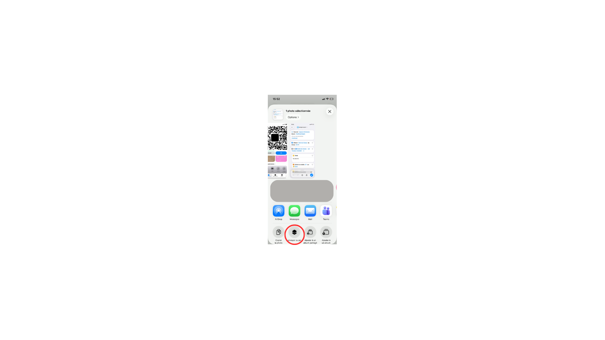
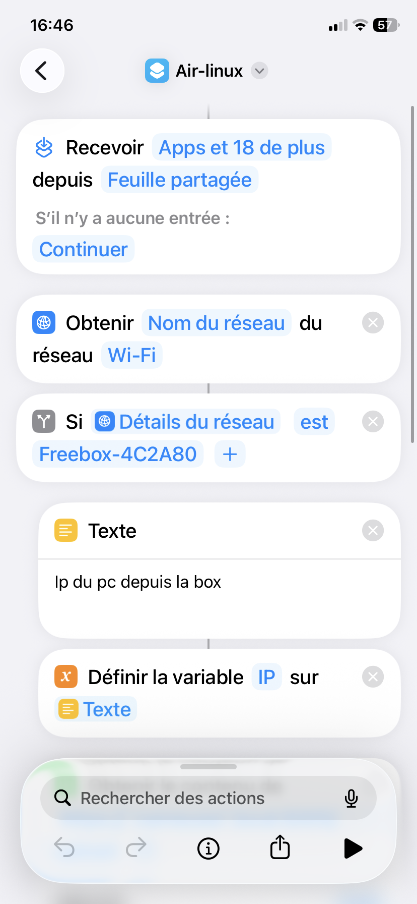
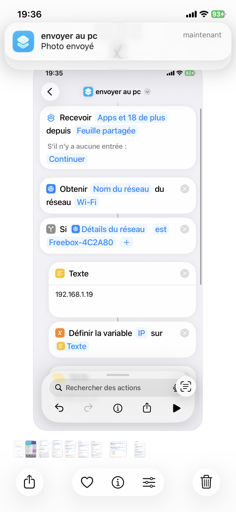
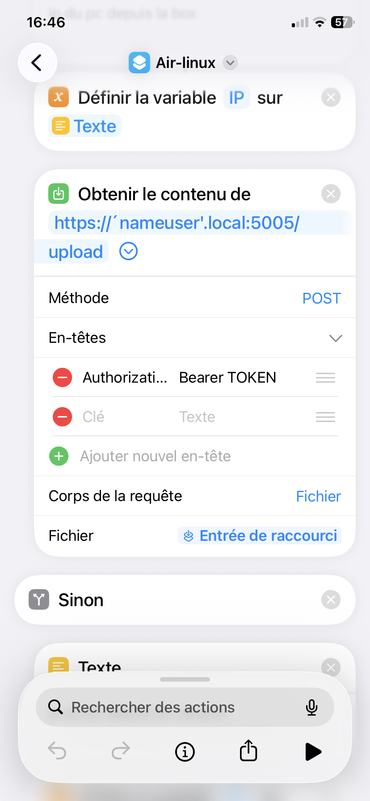
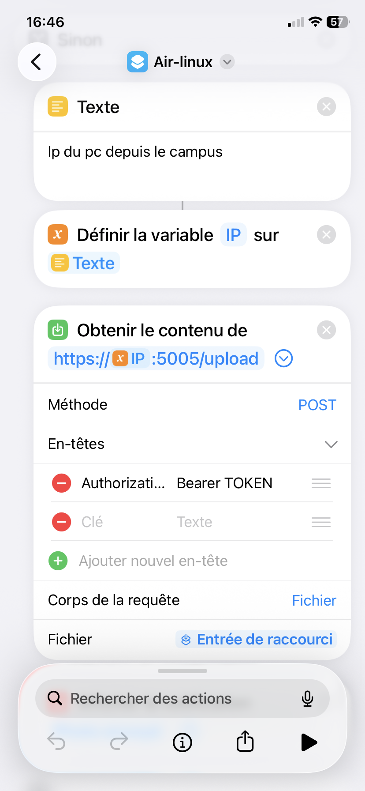
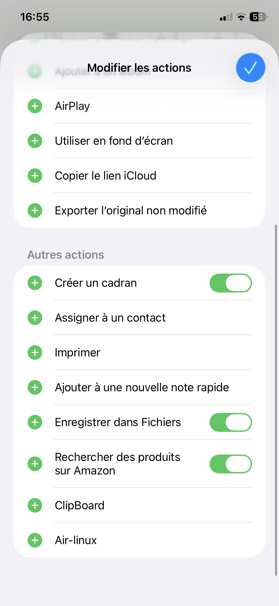
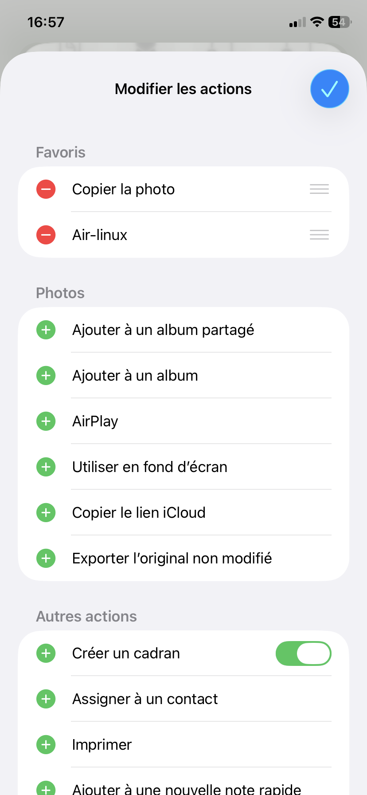

# iPhoneShare

> Envoyez photos et texte depuis votre iPhone vers votre PC Ubuntu en 2 taps — sans cloud, sans câble, sans appli tierce.

---

## Comment ça marche

1. Vous lancez le script d'installation sur votre PC → le serveur démarre automatiquement
2. Vous installez le Raccourci iOS sur votre iPhone
3. Depuis n'importe quelle app, vous appuyez sur **Partager → iPhoneShare** → la photo arrive dans `~/Downloads/`

Tout le trafic reste sur votre réseau local (Wi-Fi). Rien ne passe par internet.

---

## Fonctionnalités

| Fonctionnalité | Détail |
|---|---|
| Envoi de photos | Dépose le fichier horodaté dans `~/Downloads/` |
| Copie presse-papier | Envoie du texte directement dans le presse-papier GNOME |
| Multi-réseau | Détecte automatiquement si vous êtes chez vous ou au campus |
| Démarrage auto | Le serveur redémarre tout seul au boot du PC |
| Sécurité | Token secret + restriction par sous-réseau |
| Multi-distro | Ubuntu, Debian, Fedora, CentOS, Arch Linux |

---

## Captures d'écran

| Menu Partager | Raccourci | Notification |
|---|---|---|
|  |  |  |

---

## Installation

### Option 1 — Installation en une ligne (recommandée)

> **Prérequis :** aucun. La commande se charge de tout.

```bash
curl -fsSL https://raw.githubusercontent.com/GuillaumeLeDev/iphoneShare/master/install.sh | bash
```

`curl` télécharge le script d'installation directement depuis GitHub et l'exécute. Le script détecte qu'il tourne sans les fichiers du projet, clone automatiquement le dépôt, puis enchaîne l'installation complète — Docker, certificat SSL, token, configuration — sans aucune autre intervention de votre part.

> **Note sécurité :** cette commande exécute du code téléchargé depuis internet. Si vous préférez inspecter le script avant de l'exécuter, utilisez l'option 2.

---

### Option 2 — Installation manuelle (pour les plus prudents)

> **Prérequis :** Git installé.

```bash
git clone https://github.com/GuillaumeLeDev/iphoneShare.git
cd iphoneShare
./install.sh
```

Vous pouvez lire le contenu de `install.sh` avant de le lancer.

---

### Ce que fait le script dans les deux cas

Le script va :
- Installer Docker s'il n'est pas présent (Ubuntu, Debian, Fedora, CentOS, Arch)
- Détecter votre IP et votre réseau Wi-Fi automatiquement
- Générer un token secret
- Générer un certificat HTTPS
- Démarrer le serveur dans Docker
- Créer un fichier `SETUP_IPHONE.txt` avec toutes vos infos de configuration

Suivez les questions posées par le script (réseau maison ou campus, SSIDs Wi-Fi, dossier de destination).

### 3. Vérifier que le serveur tourne

À la fin du script, vous verrez :

```
✓ Serveur répond sur https://192.168.x.x:5005/health
```

Si ce message apparaît, c'est bon. Sinon :

```bash
docker compose logs -f
```

---

## Configuration du Raccourci iOS

### 1. Installer le Raccourci

Ouvrez ce lien **depuis votre iPhone** :

**[Télécharger le Raccourci iPhoneShare](https://www.icloud.com/shortcuts/b43932b48da747b5b42d6cc11cd6e650)**

Appuyez sur **"Configurer le raccourci"** puis **"Ajouter"**.

---

### 2. Récupérer vos informations

Ouvrez le fichier `SETUP_IPHONE.txt` généré sur votre PC par `install.sh`. Il contient tout ce dont vous avez besoin :

```
TOKEN D'AUTHENTIFICATION
  a3f9c2...  ← votre token

RÉSEAU MAISON (Freebox-XXXX)
  URL upload : https://192.168.x.x:5005/upload

RÉSEAU CAMPUS (IONIS)
  URL upload : https://10.109.x.x:5005/upload
```

---

### 3. Modifier le Raccourci

Ouvrez l'app **Raccourcis** → appuyez longuement sur **Air-linux** → **Modifier**.

Vous avez 6 valeurs à remplacer :

---

**Étape 1 — SSID et IP maison** *(écran raccourci1)*


| Champ à modifier | Remplacer par |
|---|---|
| `Freebox-4C2A80` | Votre nom de réseau Wi-Fi maison (SSID) |
| `Ip du pc depuis la box` | Votre IP maison (ex: `192.168.1.19`) |

> Appuyez sur chaque champ bleu pour le modifier.

---

**Étape 2 — URL et token réseau maison** *(écran raccourci2)*



| Champ à modifier | Remplacer par |
|---|---|
| `'nameuser'.local` dans l'URL | Votre IP maison (ex: `https://192.168.1.19:5005/upload`) |
| `Bearer TOKEN` | `Bearer` + votre token (ex: `Bearer a3f9c2...`) |

> Pour modifier l'URL : appuyez sur l'action **"Obtenir le contenu de"** → appuyez sur l'URL → modifiez.
> Pour le token : appuyez sur **"En-têtes"** → appuyez sur la valeur `Bearer TOKEN` → remplacez.

---

**Étape 3 — IP et token réseau campus** *(écran raccourci3)*



| Champ à modifier | Remplacer par |
|---|---|
| `Ip du pc depuis le campus` | Votre IP campus (ex: `10.109.252.31`) |
| `Bearer TOKEN` | `Bearer` + votre token (même valeur qu'à l'étape 2) |

---

### 4. Ajouter au menu Partager

Pour que le Raccourci apparaisse dans le menu Partager de toutes vos apps :

1. Dans n'importe quelle app, appuyez sur **Partager**
2. Faites défiler jusqu'en bas → **Modifier les actions**
3. Dans la liste, appuyez sur **+** à côté de **Air-linux**



Il apparaîtra ensuite dans vos favoris :



---

### 5. Accepter le certificat SSL (première fois uniquement)

Avant d'utiliser le Raccourci, ouvrez **Safari** sur votre iPhone et accédez à l'URL de test indiquée dans `SETUP_IPHONE.txt` :

```
https://192.168.x.x:5005/health
```

Safari affiche un avertissement de sécurité → appuyez sur **"Continuer quand même"**. Cette étape n'est nécessaire qu'une seule fois.

---

### 6. Tester

Ouvrez une photo dans **Photos** → **Partager → Air-linux** → la photo apparaît dans `~/Downloads/` en quelques secondes.

---

## Désinstallation

```bash
./uninstall.sh
```

Arrête le serveur, supprime le conteneur Docker et les fichiers générés (token, certificat). Le code source est conservé.

---

## Commandes utiles

```bash
# Voir les logs en direct
docker compose logs -f

# Redémarrer le serveur
docker compose restart

# Arrêter le serveur
docker compose down

# Redémarrer après un arrêt
docker compose up -d
```

---

## API

Pour les utilisateurs avancés ou pour tester depuis un terminal.

Toutes les routes sauf `/health` requièrent le header `Authorization: Bearer <TOKEN>`.

### `GET /health` — vérification

```bash
curl -sk https://<IP>:5005/health
# → {"status": "ok"}
```

### `POST /upload` — envoi de photo

```bash
curl -sk \
  -H "Authorization: Bearer $SECRET_TOKEN" \
  -F "photo=@image.jpg" \
  https://<IP>:5005/upload
# → {"status": "ok", "filename": "2026-04-23_14-32-01.jpg"}
```

### `POST /clipboard` — presse-papier

```bash
curl -sk \
  -H "Authorization: Bearer $SECRET_TOKEN" \
  -H "Content-Type: application/json" \
  -d '{"text": "texte à copier"}' \
  https://<IP>:5005/clipboard
# → {"status": "ok"}
```

---

## Sécurité

- **Token Bearer** : toutes les requêtes sont authentifiées
- **Filtrage IP** : seuls les sous-réseaux déclarés lors de l'installation sont acceptés
- **HTTPS** : tout le trafic est chiffré, même sur le réseau local
- **Local uniquement** : aucune donnée ne quitte votre réseau Wi-Fi

Pour changer le token : modifiez `.env` puis `docker compose restart`.

---

## Structure du projet

```
iphoneShare/
├── install.sh             # Script d'installation automatique
├── uninstall.sh           # Script de désinstallation
├── server.py              # Serveur Flask
├── requirements.txt       # Dépendances Python
├── Dockerfile             # Image Docker
├── docker-compose.yml     # Généré par install.sh
├── .env                   # Généré par install.sh (gitignored)
├── .env.example           # Template
├── cert.pem / key.pem     # Générés par install.sh (gitignored)
├── SETUP_IPHONE.txt       # Généré par install.sh
└── screenshots/
```
